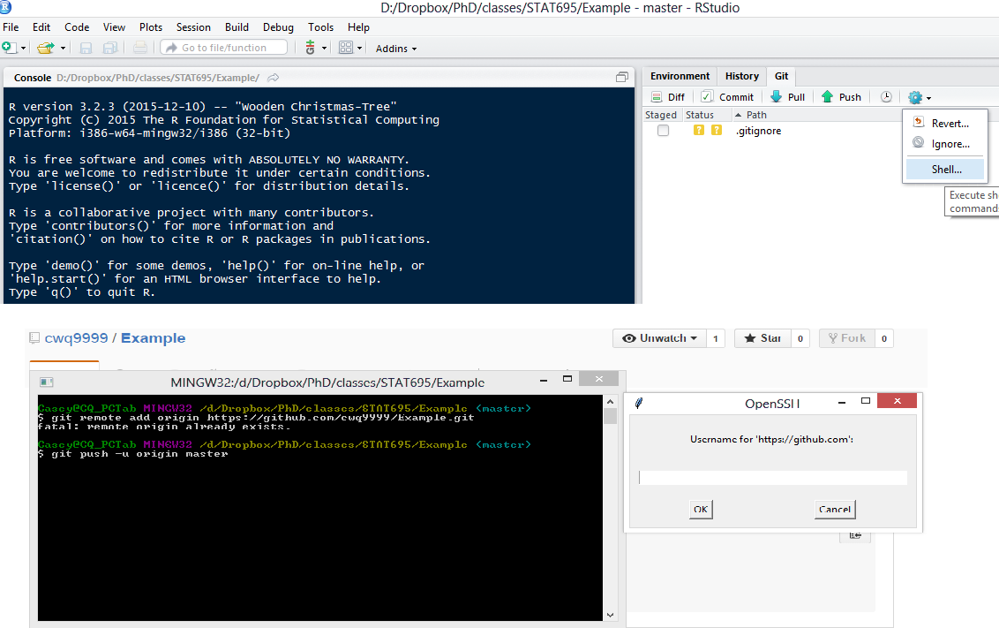

```{r setup, include=FALSE}
knitr::opts_chunk$set(echo = FALSE)

## General Instructions

# Around 15-20 slides outlining a blueprint for attacking future predictive modeling challenges. This should be based on your experiences with the first two challenges, but you can also draw on advice from our textbooks, online advice on machine learning, etc., to come up with steps you plan to take and things you plan to look for the next time you need to build a predictive model. You should cover the full process, from first getting the data through to picking a top model. Some of the steps you likely want to cover include initial exploratory data analysis, picking a metric (like RMSLE) to use to assess models, checking for and handling datasets that aren’t straightforward (e.g., have missing data, have more predictors than observations, have heavy class imbalance, are very large or very small, …), trying out different types of models and tuning models, engineering and selecting predictive variables, and choosing and running a final model. You should also include some guidelines about how to efficiently work as a team when working on a predictive modeling challenge.

```


## Predictive Modeling Approach: Overview
\begin{enumerate}
\item \textbf{Define the Problem}
\item \textbf{Understand the Data: Data Types}
\item \textbf{Understand the Data: Missing Values}
\item \textbf{Model Tuning Metric}
\item \textbf{Model Evaluations and Tuning}
\item \textbf{Github Collaboration}
\item \textbf{General Collaboration}
\end{enumerate}

## Define the Problem
\textbf{Model Complexity Constraints}
\begin{itemize}
  \item Offline, Time-averaged, "Instantaneous" Implementation
      \begin{itemize}
      \item Computation Resources
      \item Computation Time
      \item Data Handling
  \end{itemize}
\end{itemize}
  
\textbf{Model Accuracy and Precision Requirements}
\begin{itemize}
  \item "Exact" vs "Rough" Predictions
\end{itemize}

## Understand the Data: Data Types 

\textbf{Continuous}
  \begin{itemize}
  \item Independent Observations?
    \begin{itemize}
    \item Check for Autocorrelation
    \end{itemize}
  \item Exact vs. Classification Ranges  
  \end{itemize}
  
\textbf{Date/Time}
  \begin{itemize}
  \item Numeric
  \item Factor
  \end{itemize}
  
\textbf{Classification}
  \begin{itemize}
  \item Reduce factor lists as needed
  \item Variable combinations if many variables
  \end{itemize}

## Understand the Data: Missing Values

\textbf{Find Them}
   \begin{itemize}
    \item VIM: aggr function
    \end{itemize}

\textbf{Deal with Them}
  \begin{itemize}
  \item \textbf{Removal}
    \begin{itemize}
    \item{Entire Variable }
    \item{Individual Observations}
    \end{itemize}
  \item \textbf{Imputation}
    \begin{itemize}
    \item{VIM package}
    \item{mice package}
    \end{itemize}
  \item \textbf{Set as unique classification} 
  \item \textbf{Leave as is}
  \item \textbf{Handling test/prediction missing data}
  \end{itemize}

## Model Tuning Metric Considerations

  \textbf{Outcome Type}
    \begin{itemize}
    \item Continuous
      \begin{itemize}
      \item Prediction
      \end{itemize}
    
    \item Classification
      \begin{itemize}
      \item Probabilities
      \item Discrete Outcome
      \end{itemize}
    \end{itemize}

  \textbf{Data Shape}
    \begin{itemize}
    \item Normal 
    \item Skewed
    \end{itemize}

## Model Evaluations

\textbf{Methods}
\begin{itemize}
\item k-Fold Cross Validation
\item Monte Carlo
\item Bootstrap
\item Data Simulation
\end{itemize}

\textbf{Avoid Overfitting}
\newline
\newline
\textbf{Reduce Model Size / Number of Parameters}

## Github Collaboration
\begin{enumerate}
  \item Chose a team leader.
  \item Team leader creates a local folder with a descriptive name for the project.
  \item Team leader creates a local RProject with the same name as the folder. 
  \item Team leader creates a Github repository with the same name as the RProject (Don't initialize with README).
\end{enumerate}

\centerline{\includegraphics[height=2in]{images/image1.png}}
  
## Github Collaboration (cont.)  
\begin{enumerate}
\setcounter{enumi}{4}
\item Push an existing repository from RStudio Shell.
    \begin{itemize}
    \item git remote add origin https://github.com/cwq9999/Example.git
    \item item git push -u origin master
    \end{itemize}
\end{enumerate}


## Github Collaboration (cont.)  
\begin{enumerate}
\setcounter{enumi}{5}
\item Add team members as collaborators.
  \begin{itemize}
  \item Collaborators can use Pull/Push buttons under the Git tab. 
  \item No need to fork the repo or request pull requests.
  \end{itemize}
\end{enumerate}

\centerline{\includegraphics{images/image4.png}}

## General Collaboration: Team Efficiency (My two cents)
\begin{enumerate}
\item Select a team leader

\item Quick Individual Exploratory Data Analysis

\item Initial Exploratory Data Analysis Discussion(s)
  \begin{itemize}
  \item Define Training/Test Datasets
  \item Determine Outcome Requirements
  \item Determine Metric(s)
  \end{itemize}

\item Divide into Specialty Groups  
  \begin{itemize}
  \item General Linear Models
  \item Trees
  \item Support Vector Machines
  \item etc.
  \end{itemize}
\item Present and Compare Models
\item Select Model Type and Refine as a Group or Subgroups
\end{enumerate}

## General Collaboration: Loading Packages (Require vs Library)

\textbf{Library}
\begin{itemize}
\item Loads a Library and causes an \textit{\textbf{Error}} if Library doesn't exist.
\item Best option for collaboration.
\end{itemize}

\textbf{Require}
\begin{itemize}
\item Tries to load a Library and provides a \textit{\textbf{warning}} if library doesn't exist.
\item Not a good option for collaboration.
\item Primarily designed for functions.
\end{itemize}

## General Collaboration: Relative vs Absolute Pathnames


```
#Set working directories
my_dir1 <- "C:/Docs/Dropbox/PhD/classes/STAT695/BikeShare"
#my_dir2 <- ""

if(dir.exists(my_dir1)){
  setwd(my_dir1)
}#else if(dir.exists(my_dir2)){
#  setwd(my_dir2)

```

## General Collaboration: RProjects and Dropbox

\begin{itemize}
\item Continuously syncs to Dropbox.
\item Remember to close your Rproject.
\item Otherwise you won't be able to sync your Dropbox
\item Better to have separate Projects for each collaborator.
\end{itemize}

## General Collaboration: Operating Systems

\begin{itemize}
\item Be wary of character differences between operating systems and potentially even versions of R or RStudio.
\item The \textit{\textbf{"$\sim$"}} has been an issue in the past.
\end{itemize}


## Rmarkdown....

\begin{itemize}
\item It's challenging and takes time to learn. 
\item Rmarkdown formatting doesn't work very well!
  \begin{itemize}
  \item You can't even bold highlight a bullet list item with the *** command. 
  \item If you know HTML or LateX don't bother with RMarkdown formatting. 
  \end{itemize}
\end{itemize}  
  
## References

\begin{itemize}
\item Kuhn. Applied Predictive Modeling
\item www.github.com
\item http://yihui.name/en/2014/07/library-vs-require/
\end{itemize}