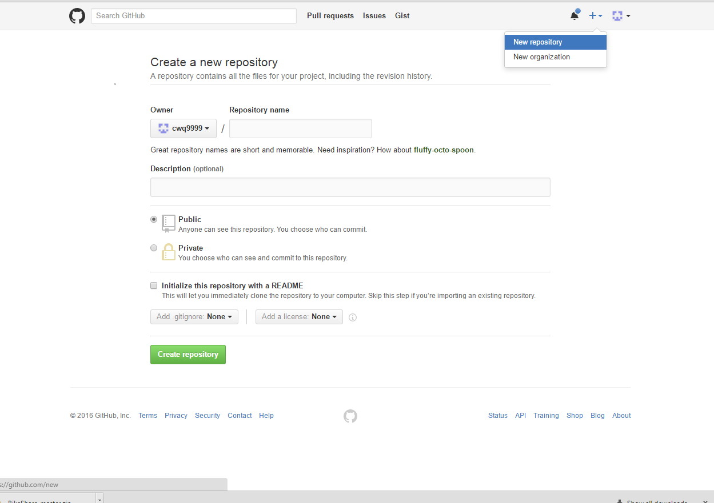

```{r setup, include=FALSE}
knitr::opts_chunk$set(echo = FALSE)
```

## General Instructions

Around 15-20 slides outlining a blueprint for attacking future predictive modeling challenges. This should be based on your experiences with the first two challenges, but you can also draw on advice from our textbooks, online advice on machine learning, etc., to come up with steps you plan to take and things you plan to look for the next time you need to build a predictive model. You should cover the full process, from first getting the data through to picking a top model. Some of the steps you likely want to cover include initial exploratory data analysis, picking a metric (like RMSLE) to use to assess models, checking for and handling datasets that aren’t straightforward (e.g., have missing data, have more predictors than observations, have heavy class imbalance, are very large or very small, …), trying out different types of models and tuning models, engineering and selecting predictive variables, and choosing and running a final model. You should also include some guidelines about how to efficiently work as a team when working on a predictive modeling challenge.

## Github Collaboration
    + Chose a team leader.
    + Team leader creates a local folder with 
    a descriptive name for the project.
    + Team leader creates a local RProject with 
    the same name as the folder. 
    + Team leader creates a Github repository with 
    the same name as the RProject (Don't initialize with README).
    + Push an existing repository from RStudio Shell.
        
        git remote add origin https://github.com/cwq9999/Example.git
        git push -u origin master
        
    + Add team memebers as collaborators.
        - As colloaborators can use Pull/Push buttons under the Git tab 
        (no need to fork the repo or request pull requests etc.)

## Slide with image



## Slide with R Output

```{r cars, echo = TRUE}
summary(cars)
```

## Slide with Plot

```{r pressure}
plot(pressure)
```

